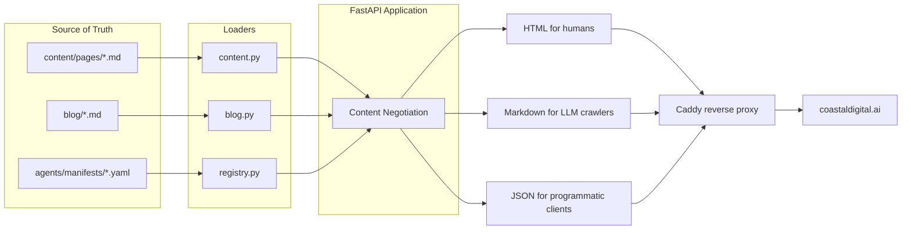

Every website has two audiences now. The visitor reading on a laptop and the agent fetching the page on someone else's behalf are not going to engage with the same payload well. Most sites pick one and bolt the other on later, badly. cdr-home is the inverse: we picked both at the same time, on the same routes, with content negotiation deciding what each visitor sees.

## Purpose

cdr-home is the public site for Coastal Digital Research. It's also the reference implementation for the dual-mode pattern: human-readable HTML pages and machine-readable JSON/Markdown endpoints, both served from the same source of truth, with proper content negotiation so each request gets what it asked for. The codebase is small enough that we use it as a working example of how the rest of our agent infrastructure should think about web surfaces.

Every page on this site is reachable three ways. The HTML at `/page/mission` is what a browser sees. The Markdown at `/agent/page/mission.md` is what an LLM crawler gets when it sends `Accept: text/markdown` or shows up with a known LLM user-agent. The JSON at `/agent/page/mission.json` carries the same content plus metadata, useful for programmatic consumers.

## Architecture

The stack is intentionally minimal. FastAPI for routing. Jinja2 templates. Python's `markdown` library for server-side rendering. No database. Content lives in `content/pages/*.md` and `blog/*.md` with YAML frontmatter; agent manifests live in `agents/manifests/*.yaml`. The app reads from disk on startup and serves the results.

The interesting bit is the content negotiation layer. Each `/page/{slug}` request runs through `_wants_format()`, which checks (in order) an explicit `?format=` query parameter, the `Accept` header, then the User-Agent string. LLM crawlers like GPTBot, ClaudeBot, and PerplexityBot auto-get Markdown because that's a cleaner payload for them. Search-engine crawlers like Googlebot get HTML because their rankings should reflect what humans see. Everyone else gets HTML by default.

Every response carries a `Link` header advertising the alternate representations, so any client that pays attention to standards can discover the other formats without guessing URLs. The `Vary: Accept, User-Agent` header keeps caches honest.

## Design decisions we made on purpose

**Disk is the database.** Content authoring happens in plain Markdown files, committed to git, deployed in a container image. No CMS to operate, no schema migrations, no editorial state machine. The version history is the audit trail. The cost is that publishing requires a deploy. We're fine with that.

**One source of truth, three views.** The Markdown body of a page is rendered server-side into HTML for humans, served raw to agents that ask for Markdown, and packaged into JSON (alongside frontmatter metadata) for programmatic clients. We never maintain three versions of the same content.

**Auto-detection over explicit opt-in.** Most LLM crawlers don't bother to send a proper Accept header. We sniff the User-Agent and serve them Markdown anyway. They're better served, we save bytes, the human visit isn't affected.

**Standard headers over custom mechanisms.** `Link: rel="alternate"`, `Vary`, `Accept`, query-string overrides. Nothing in here is exotic. If someone reads this and wants to do it on their own site, none of the moving parts are CDR-specific.

## Integration with other CDR projects

cdr-home is the surface, not infrastructure that other agents depend on. The integration story runs in the other direction: this site documents and links to the rest of the work.

- [**Orchestack**](/blog/orchestack-architecture) documents itself through the `/.well-known/agent.json` discovery pattern that cdr-home demonstrates. Any external operator integrating with a CDR-hosted agent platform can start from the same convention.
- [**The agent registry**](/agents) at `/agents` and the manifests under `agents/manifests/` are a reference for how CDR-style agent declarations look in YAML. Agents we run on Orchestack publish manifests in the same shape.
- The dual-mode pattern itself is something we hope other CDR projects adopt for their own admin or status surfaces. There's no library yet; the right move is probably to write one once we've used the pattern in two or three more places.

## Status

In production at https://coastaldigital.ai. Source at github.com/CoastalDigitalResearch/cdr-home.

What's built:

- HTML pages with server-side rendered Markdown
- Blog posts with Mermaid diagram support
- Agent endpoints for pages, blog posts, and agent manifests
- Content negotiation by Accept header, query parameter, and User-Agent
- Discovery via `/.well-known/agent.json`
- A voice-check workflow that runs against drafts before publish
- Auto-deploy pipeline via Forgejo Actions, with Forgejo as canonical source and GitHub as a public mirror

What's intentionally not built:

- Comments. They're a moderation burden and add nothing to a small site like this.
- User accounts. Everything is public.
- Analytics beyond standard server logs.
- A search index. The site is small enough that the agent endpoints are a better search interface than anything we'd ship.

## Open questions we're working through

- The HEAD-request 405 issue. FastAPI's GET-only routes return 405 for HEAD requests, which trips up some scrapers and uptime monitors that use HEAD by default. We could add HEAD support explicitly, or let Caddy synthesize HEAD from GET. Probably the latter.
- Streaming. The full Mermaid library is loaded only on blog post pages, which is fine, but the load is still a few hundred KB. A self-hosted slimmer build would be faster. Worth doing once we have more than five posts.
- The `unlisted: true` flag on the legacy launch post hides it from the index but the file stays in the image. Should unlisted posts be removed from the agent JSON listing as well, or kept discoverable? Currently they're served by direct slug but absent from `/agent/blog.json`. We're leaving them out of the listing for now and revisiting if that's wrong.
- We use a smarty markdown extension that renders straight quotes into curly quotes. This is correct for humans and slightly annoying for agents (curly quotes mess up some downstream tooling). The agent Markdown endpoint serves the raw body, but the JSON endpoint serves the metadata only. Should we also offer a "raw text" view that strips smarty? Probably yes; nobody's asked yet.
