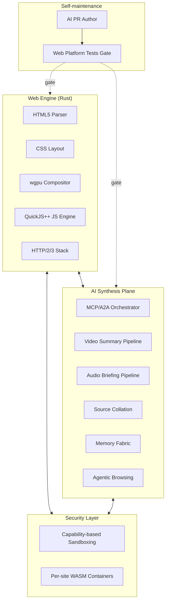

There are two kinds of "AI browser" projects right now. There are wrappers around Chromium that add a side panel for a chatbot. And there are scraping agents that drive a headless browser. Both treat the browser as a fixed substrate with AI bolted on. CDRbrowser asks a different question: what does a browser look like if the engine itself is greenfield, the AI features are native to the architecture instead of bolted on, and the codebase is maintained by AI agents using a WPT-gated CI pipeline?

## Purpose

CDRbrowser is a 100% AI-built and AI-maintained web browser. The engine is clean-slate Rust, not a Chromium or Firefox derivative. The AI synthesis plane is a first-class architectural component, not a feature panel. The browser ships video summaries, audio briefings, source collation, and agentic browsing as native capabilities of the runtime, rather than as features that wrap third-party APIs.

The "AI-maintained" framing matters too. The browser's codebase is intended to evolve through AI-authored PRs gated by the Web Platform Tests (WPT) suite in CI. Humans review, but the day-to-day work of fixing parser quirks and adding standards conformance is done by agents.

## Architecture

CDRbrowser splits cleanly into a web engine and an AI synthesis plane, with capability-based sandboxing as the security spine.

The web engine is straightforward as Rust browser engines go. HTML5 parsing, CSS layout, wgpu for composition, QuickJS++ for JavaScript, HTTP/2 and HTTP/3 for the network stack. The work is in the implementation, not the architectural novelty.

The AI synthesis plane is where CDRbrowser is different. The MCP/A2A orchestrator coordinates between the engine and a set of multimodal pipelines: video summaries pulled from page content, audio briefings generated for the visually impaired or the busy, source collation that traces claims back to references, and a memory fabric that remembers what you've already read so the synthesis layer can avoid repeating itself. Agentic browsing is the umbrella for "the browser navigates on your behalf with a specific goal," which works because the AI plane shares the engine's view of the page rather than scraping HTML from outside.

Security is capability-based throughout. Per-site WASM containers limit blast radius when a site does something hostile. Capabilities are scoped, not blanket; a site that asks for clipboard access doesn't get filesystem access by default.

Self-maintenance is the moonshot. The codebase has an AI PR author that proposes changes (parser bug fixes, conformance improvements, refactors) and gates them behind the Web Platform Tests suite. A change that breaks WPT doesn't merge. A change that improves WPT score is a candidate for review.

## Design decisions we made on purpose

**Clean-slate engine.** Forking Chromium would have been easier in the short term. It would also mean inheriting decades of accreted code that doesn't match how we want the AI plane to integrate. Greenfield Rust is the right substrate for AI-native browser features.

**AI as architectural plane, not feature panel.** Chatbot side panels are afterthoughts. CDRbrowser's AI features have hooks into the engine itself: the renderer can ask the synthesis plane what to summarize, the synthesis plane can ask the renderer for layout structure. This isn't doable when AI is bolted on through an extension API.

**WPT-gated CI.** A browser that breaks the web is worse than no browser. The Web Platform Tests are the closest thing to objective truth about whether a change broke standards. Every AI-authored PR runs against WPT and a regression on score is a blocking failure.

**Capability-based sandboxing.** "All or nothing" permissions are how browsers got into the position where every site has access to too much. Capability-based scoping is the alternative: a site gets exactly the access it needs and nothing else, requested per-action rather than at install time.

## Integration with other CDR projects

CDRbrowser is a sibling to the rest of CDR work, not a building block for it. The integration story is mostly the other direction: CDRbrowser uses CDR infrastructure rather than the other way around.

- [**CDRcache**](/blog/cdrcache-architecture) memoizes the synthesis plane's outputs. The "video summary for URL X with model Y at quality Z" call is exactly the kind of repeated, deterministic-given-inputs work that benefits from hash-addressed caching.
- [**Orchestack**](/blog/orchestack-architecture) can host the AI synthesis plane's heavier workloads. Local pipelines for short summaries; Orchestack-routed agents for multi-step research that exceeds the browser's local budget.
- [**TopoLI**](/blog/topoli-architecture) is a candidate for the source collation pipeline. Pruned token embeddings are exactly the kind of retrieval primitive that makes "find related claims across pages" tractable at browser-side scale.
- [**CDRdistill**](/blog/cdrdistill-architecture)-trained smaller models could power the local synthesis pipelines, especially the ones that need to run inside a per-site WASM container with no network access.

## Status

Early. Source at github.com/CoastalDigitalResearch/CDRbrowser.

What's targeted for an initial usable build:

- HTML5 parsing and CSS layout correct enough to render most modern sites
- wgpu compositor with hardware-accelerated rendering
- QuickJS++ JS engine integrated
- HTTP/2 and HTTP/3 stack
- The MCP/A2A orchestrator scaffold for the AI synthesis plane
- A first video summary pipeline
- Capability-based sandboxing scaffolding
- AI PR author with WPT scoring in CI

What's not yet in scope:

- Full Web Platform Tests parity. The goal is "viable for daily use against common sites," not "drop-in replacement for Chrome."
- DRM-protected content. Not a near-term focus.
- A web store of third-party extensions. The plugin model will look more like capability-scoped WASM containers than the traditional extension API.

## Open questions we're working through

- **The viable WPT score threshold.** Above what level of WPT pass rate does CDRbrowser become useful for daily browsing? 70%? 85%? The honest answer depends on which 15% you're missing.
- **The split between local synthesis and remote synthesis.** Some AI features only make sense with a real model behind them. How much of the synthesis plane has to be local-only, and how much can route remotely with the user's consent? The capability model gives the user fine-grained control; the defaults are the question.
- **JS engine choices.** QuickJS++ is a sensible starting point. V8 is faster but huge. SpiderMonkey is solid but complicates licensing. As the engine matures, the JS layer is one of the places that may need to change.
- **Self-maintenance scope.** AI-authored PRs for parser bug fixes is one thing. AI-authored PRs for security-sensitive changes is another. Where exactly do we draw the line? We'd rather draw it conservatively early and relax it as the AI author's track record builds.
