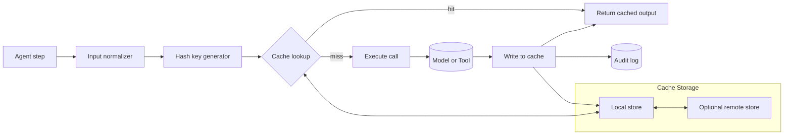

LLM inference is expensive. Tool invocations are expensive. Multi-step agent pipelines are extremely expensive. And a meaningful fraction of those calls are redundant: the same prompt with the same context, the same tool with the same arguments, fed back through the system over and over because nothing remembered the answer. CDRcache is the layer that fixes that.

## Purpose

CDRcache is a semantic caching and retrieval system for AI agent pipelines. The premise is straightforward. If an agent step is a deterministic function of its inputs (model + prompt + context + tool args), the output can be hashed, stored, and returned on the next identical call without re-running anything. Cost goes down. Latency goes down. Audit trail goes up.

The "semantic" part matters. A naive cache that keys only on the exact byte-for-byte input will miss a lot of opportunities, because real-world prompts include timestamps, request IDs, and whitespace differences that don't change the semantic content. CDRcache normalizes inputs before hashing so functionally identical calls hit the cache, while genuinely different calls don't.

## Architecture

CDRcache sits in the middle of an agent's call path. The agent (or its harness) asks the cache for a result first. On a hit, the cached output is returned and the underlying model or tool call is skipped. On a miss, the agent executes the call, and the result is written back to the cache keyed by the input hash.

Storage is content-addressed, so the cache key is derived from the input itself. Entries are immutable once written, which makes the cache double as a tamper-evident audit trail. You can always replay exactly what an agent received as input and exactly what it returned, at exactly what time.

## Design decisions we made on purpose

**Content addressing, not key namespacing.** The hash of the normalized input *is* the key. There's no separate naming scheme to coordinate, no risk of two agents accidentally colliding on a name, no need to manage cache invalidation through key rewrites.

**Immutable entries.** Once written, a cache entry doesn't get overwritten. If a model version changes and produces a different output for the same input, that's a new entry. The old entry stays. This is essential for the audit-trail use case: you should never wonder whether a stored output was tampered with after the fact.

**Local-first storage.** CDRcache works as a process-local cache, scales to a host-local cache, and can federate to a shared cache across hosts when that's needed. Default is local because the latency win is largest there and most workloads don't need cross-host sharing.

**Caching is opt-in per step.** Some agent steps shouldn't be cached because their outputs aren't actually deterministic (time-sensitive queries, randomized generation). The harness decides per-step whether to consult the cache, rather than CDRcache trying to guess.

## Integration with other CDR projects

CDRcache is foundational infrastructure. It plugs in underneath most other CDR work that does meaningful inference or tool execution.

- [**Orchestack**](/blog/orchestack-architecture) uses CDRcache inside the Loop Runner. Every agent step in a session is a candidate for cache lookup before execution; the Policy Evaluator can mark steps as non-cacheable when needed (e.g., for time-sensitive tasks or audit-required reruns).
- [**mae**](/page/projects#mae) caches its long-running task intermediates through CDRcache. When mae is reasoning about a multi-step system change, repeated subqueries against the same machine state hit the cache rather than burning tokens.
- [**rlm-linux**](/page/projects#rlm-linux) uses CDRcache to memoize conductor workflow outputs. When the same kind of system event recurs (a package upgrade, a config drift detection), the conductor's planning step often produces the same workflow, and the cache short-circuits.
- [**CDRdistill**](/page/projects#cdrdistill) and [**TopoLI**](/page/projects#topoli) use CDRcache during research runs where the same embedding computations and the same retrieval scores get recomputed across experiments. Caching them is the difference between "rerun in seconds" and "rerun in minutes."

## Status

Early but in active use. Source at github.com/CoastalDigitalResearch/CDRcache.

What's built:

- Content-addressed storage with normalized input hashing
- Immutable entry semantics
- Local-process and local-host backends
- A pluggable storage interface (so a Redis or PostgreSQL backend is straightforward to add)
- Audit log of all cache reads and writes

What's not yet built:

- A remote shared-cache backend with proper concurrency semantics for multi-host setups
- Eviction policies beyond manual purge (LRU, size cap, age cap)
- A management UI for inspecting and pruning entries
- Tooling to detect "cache-hostile" inputs (inputs that look deterministic but actually aren't, like prompts containing a `now()` timestamp the agent forgot to strip)

## Open questions we're working through

- **Determinism in practice.** Most models are nominally deterministic at temperature 0, but in practice GPU kernel non-determinism, batched inference effects, and tokenizer edge cases produce small output variations for identical inputs. How tolerant should CDRcache be? A strict byte-match policy maximizes correctness; a tolerance window (Levenshtein, embedding similarity) maximizes hit rate. We don't have a clean answer yet.
- **Cache invalidation when the model changes.** New model version equals new entry under content addressing, which is correct but also means the entire cache is functionally invalidated by a model swap. Should there be a "translation" pass that detects equivalent outputs across model versions and links the entries? Probably not, but it's a real cost question for production agents.
- **Sensitive data.** Cache entries can contain anything that flows through an agent. We say "no PII in cache" as a hard rule, but enforcement is currently the caller's job. Is there a sensible scanning policy that catches obvious mistakes (credit card numbers, SSN patterns) without false-positive-storming legitimate use cases? Worth exploring.
- **The right granularity.** Cache a whole agent step? A whole tool invocation? A model call? An embedding lookup? We currently support all three but don't have strong guidance on which to use when. This is the kind of thing that should turn into a write-up once we have more real-world data.
