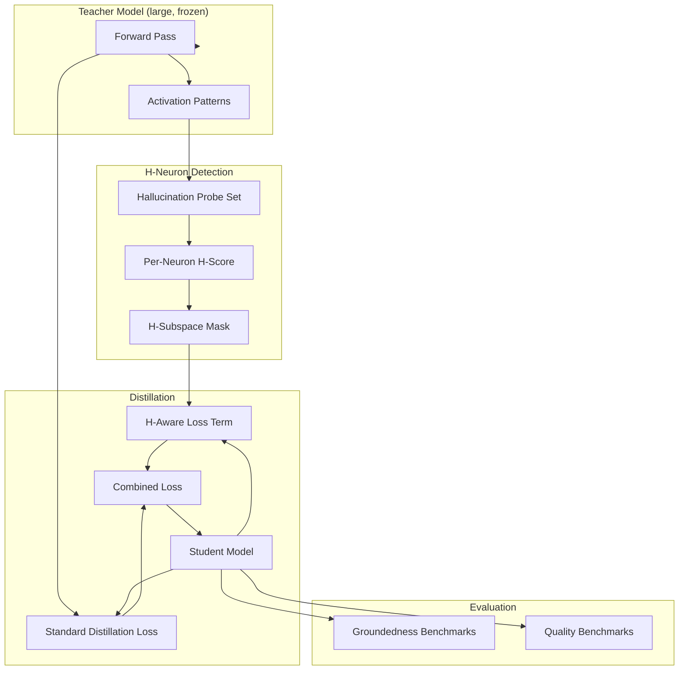

Distillation gives you a smaller model. Hallucination gives you an unreliable model. Most distillation work treats the second problem as a downstream concern: distill first, then bolt on RAG or fact-checking to clean up the lies. CDRdistill takes a more invasive bet: hallucination is not uniformly distributed in the model, and the components most responsible for it can be detected and treated during distillation itself.

## Purpose

CDRdistill is a hybrid distillation framework that uses H-subspace (hallucination neuron) detection to guide knowledge distillation. The output is smaller models that are measurably more grounded and less prone to hallucination than the same architecture distilled without H-aware guidance.

The premise is that hallucination correlates with specific subspaces of the model's activation patterns, not with the model as a whole. If you can identify those subspaces in the teacher model, you can preferentially preserve or penalize the corresponding behaviors during distillation, producing a student that inherits the teacher's useful behavior without inheriting as much of its tendency to make things up.

## Architecture

CDRdistill is a modification to a standard teacher-student distillation pipeline. The detection pass identifies H-neurons in the teacher. The distillation pass uses that information to adjust the loss function targets for the student.

The detection pass uses a curated hallucination probe set: input/output pairs where the teacher's response is verifiably true or verifiably false. The activation patterns on hallucinating responses are compared against the activation patterns on grounded responses. Neurons whose activation strongly correlates with hallucinating outputs get a high H-score. The set of high-H-score neurons forms the H-subspace mask.

During distillation, the standard loss (match the teacher's outputs) is augmented with an H-aware term that penalizes the student for producing activation patterns aligned with the teacher's H-subspace. The combined loss pushes the student to mimic the teacher in general while diverging from the teacher specifically where the teacher is most likely to hallucinate.

Evaluation runs on two axes. Groundedness benchmarks measure how often the student produces factually correct answers on verifiable questions. Quality benchmarks measure that we haven't lost general capability in the process. A successful CDRdistill run shows the student stronger on groundedness without significant loss on quality.

## Design decisions we made on purpose

**Hallucination as a locatable phenomenon.** The whole framework rests on this premise. If hallucination were uniformly distributed across the model, there would be nothing to detect and nothing to selectively suppress. Empirically, it isn't uniform: certain neurons activate disproportionately on hallucinating outputs. We're working in that space.

**Distillation-time intervention, not post-hoc filtering.** Adding a fact-check pass after the model speaks is reactive. Building groundedness into the student during training is proactive and doesn't require runtime overhead.

**Probe-set-driven detection.** The H-subspace is defined empirically by what the probe set marks as hallucination. This means CDRdistill is only as good as the probe set, which is a real limitation. It also means the framework is auditable: someone can inspect the probe set and challenge the labeling.

**Combined loss, not hard replacement.** The H-aware term is added to the standard distillation loss with a weighting factor, not used in place of it. The student is meant to be a useful smaller version of the teacher, not a different model that happens to hallucinate less.

## Integration with other CDR projects

CDRdistill is research that produces concrete artifacts (distilled, more grounded models) that the rest of CDR can use.

- **CDRnext** (private) consolidates the CDRdistill and CDRmem research into a deployable architecture. The H-aware distillation technique is one of the components that informs how CDRnext approaches groundedness.
- [**CDRmem**](/blog/cdrmem-architecture) is sister research. CDRmem is about how a model accesses memory; CDRdistill is about how that model gets to be both small and grounded. Both feed into the same broader goal: smaller, more reliable models.
- [**Orchestack**](/blog/orchestack-architecture)'s Model Router benefits when more grounded smaller models are available. The router prefers local models when data sensitivity is high; a more grounded local model means the router can choose local more often without sacrificing quality.
- [**fpre**](/blog/fpre-architecture)'s proposer model is a candidate target for CDRdistill. The proposer doesn't need to be a 70B; it needs to be reliable on the kinds of step proposals the engine cares about. A CDRdistill-trained proposer would be smaller and more grounded.
- [**CDRcache**](/blog/cdrcache-architecture) memoizes the expensive parts of distillation runs. Re-running an H-detection pass against the same teacher and probe set is wasted work; the cache catches that.

## Status

Active research. Source at github.com/CoastalDigitalResearch/CDRdistill.

What's built:

- The H-neuron detection pipeline using probe-set activation analysis
- The hybrid loss function combining standard distillation and H-aware penalty
- A probe set covering common hallucination patterns (factual, citation, numerical)
- Evaluation harness running groundedness and quality benchmarks

What's not yet in scope:

- Published numbers on a large teacher. Current experiments are on smaller teacher-student pairs; the scaling behavior to flagship-size teachers is the next question.
- A learned probe set. The current probe set is hand-curated; expanding it through systematic generation would improve coverage but introduces its own labeling problems.
- Integration with techniques that target hallucination through different mechanisms (retrieval augmentation, chain-of-thought verification). These are complementary; the right combination isn't obvious.

## Open questions we're working through

- **H-subspace stability.** Are the H-neurons consistent across training checkpoints of the same model? Across different fine-tunes? Across model families? The framework works best if the answer is "yes, mostly." Empirically it seems to hold for similar models; we don't have clean cross-family data yet.
- **Probe-set bias.** The detection inherits whatever blind spots are in the probe set. A probe set that misses an entire category of hallucination won't mark the responsible neurons. How to construct a probe set that's actually representative is an open problem and probably worth its own writeup.
- **Compute cost.** Detection adds a pass over a curated dataset; the H-aware loss term adds compute per training step. Combined, CDRdistill is meaningfully more expensive than standard distillation. The cost-vs-groundedness trade is sensitive to model size and data scale.
- **Relationship to RLHF and DPO.** Both of these methods can also suppress hallucination, with different mechanics and different costs. Does CDRdistill stack with them? Conflict with them? The interaction matrix isn't well understood yet.
