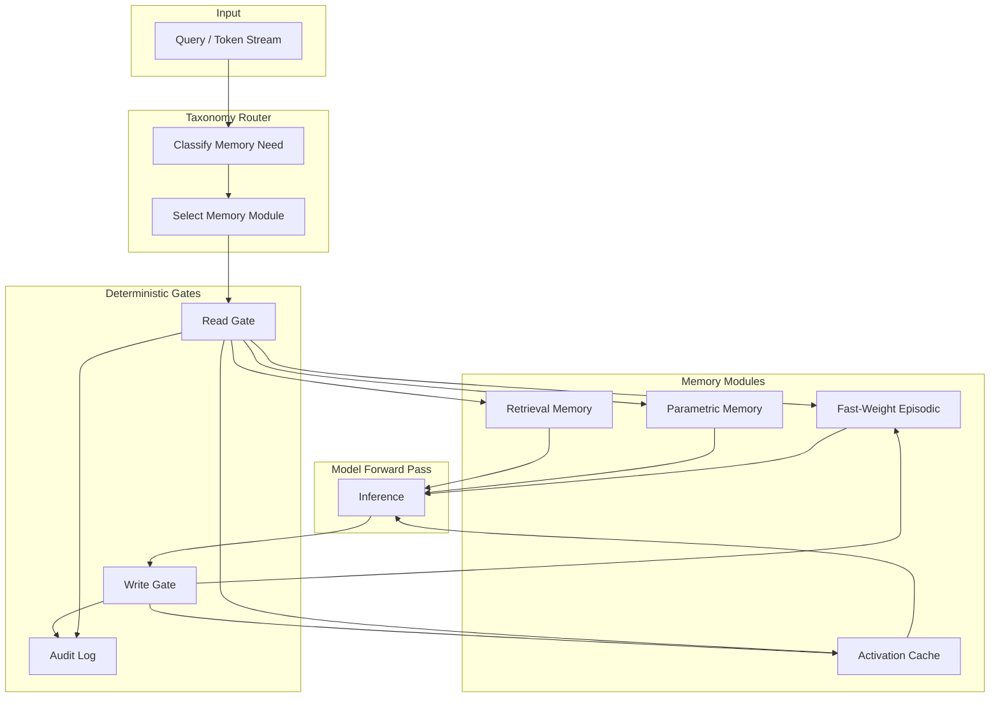

When people say "memory for language models" they usually mean one of two things: a vector database the model can query, or a longer context window. Both are real, and neither is quite the same as how a model actually remembers things internally. CDRmem is the research project that asks a third question: what are the architectural memory patterns that should exist inside the model itself, with proper access gates and auditability?

## Purpose

CDRmem is research and implementation of architectural memory patterns for language models. The components include taxonomy-routed retrieval (deciding which memory to consult based on what's being asked), fast-weight episodic memory modules (short-horizon memory that can be written and overwritten without retraining), and deterministic memory gating (predictable, auditable rules for when and how memory is accessed).

The framing matters. Most memory work treats memory as an external substrate: "the model is the inference engine, the memory is over there." CDRmem treats memory as architectural: gates and access patterns built into the model's computation, not retrofitted around it.

## Architecture

CDRmem composes three pieces: a taxonomy router that decides which memory to consult, fast-weight modules that hold short-horizon episodic context, and deterministic gates that govern when reads and writes happen.

The taxonomy router classifies the model's current memory need. Some queries need parametric memory (what the model learned during training). Some need retrieval memory (external knowledge bases). Some need fast-weight episodic memory (this session's recent context). Some need activation cache (intermediate computations from the current input). The router decides which to consult.

Fast-weight modules are the interesting research component. They're parameter sets that can be updated during inference on a short horizon, without backprop and without affecting the base model weights. A model can write a fact into a fast-weight module mid-conversation and read it back a few turns later. The module is wiped between sessions or on an explicit schedule. This is closer to how human working memory feels than either context windows or RAG.

Deterministic gates govern access. Reads from each memory module are gated by explicit rules; writes are gated by separate rules. Every read and every write goes through an audit log. This is the part that makes memory access inspectable rather than mysterious.

## Design decisions we made on purpose

**Memory as architectural plane, not external substrate.** Putting memory inside the model's computational graph rather than alongside it changes what's possible. Fast-weight modules wouldn't be coherent as a separate service; they only work because they participate in the forward pass.

**Taxonomy routing.** Different memory types have different cost and latency characteristics. Parametric memory is free at inference; retrieval memory is expensive; fast-weight is cheap but small; activation cache is free but volatile. The router matches the need to the right type rather than always defaulting to the heaviest option.

**Deterministic gating.** Gates are rules, not heuristics. "If the current token's classification is X and the context's recency is Y, read from module Z." This makes memory access predictable, debuggable, and auditable. Stochastic gates would be more flexible and less safe.

**Audit by default.** Every read and every write is logged with enough detail to reconstruct the access pattern. This is essential for both research (what's the model actually doing?) and any future deployment (can we trust what it remembered?).

## Integration with other CDR projects

CDRmem is research that feeds into production agent memory through several integration paths.

- **CDRnext** (private; the successor to both CDRmem and CDRdistill consolidating their research into a deployable architecture) is the direct downstream consumer. The memory gates and fast-weight modules from CDRmem are what we want plugged into the actual model architecture in CDRnext.
- [**Orchestack**](/blog/orchestack-architecture)'s tiered memory system (hot, warm, cold, archive) is the storage side of the same problem. CDRmem is about how the model accesses memory; Orchestack's tiers are about where that memory physically lives. They're complementary.
- [**CDRcache**](/blog/cdrcache-architecture) caches at the agent step level. CDRmem operates at the model-internal level. The two don't overlap, but a model using CDRmem-style memory gates produces more stable per-step outputs, which makes CDRcache more effective downstream.
- [**fpre**](/blog/fpre-architecture)'s engine could use fast-weight modules as a working-memory substrate for in-progress proof states. That's speculative right now.

## Status

Active research. Source at github.com/CoastalDigitalResearch/CDRmem.

What's built:

- Architectural sketches and proof-of-concept implementations of the three memory components
- The deterministic gate framework with audit logging
- Taxonomy router with hand-built classification rules
- Test harness for evaluating memory hit rates against synthetic conversation patterns

What's not yet in scope:

- Integration with a real production-scale model. Current experiments are on smaller research scales.
- Learned classification for the taxonomy router. The hand-built rules are a starting point; a learned router is the obvious next step.
- Cross-session memory persistence. Fast-weight modules currently wipe between sessions by design; some applications would want longer-horizon persistence with appropriate gating.

## Open questions we're working through

- **Fast-weight stability.** Fast-weight updates during inference can interfere with the base model's behavior in subtle ways. How small can the update be while still being useful? What kinds of writes are safe? We have some empirical answers; we don't have a clean theoretical bound.
- **Gate complexity.** Simple gates are predictable but limited; complex gates can model more nuanced access patterns but lose the auditability advantage. The sweet spot is unclear and probably depends on the deployment.
- **Taxonomy boundaries.** "What kind of memory does this query need?" sounds clean but isn't. Many queries genuinely need multiple memory types simultaneously. The router needs to handle that gracefully, which complicates its design.
- **Relationship to RAG.** A retrieval-augmented system is essentially "all memory access goes through one type." CDRmem says "different access for different needs." Whether the additional complexity buys you enough on real workloads is the empirical question.
