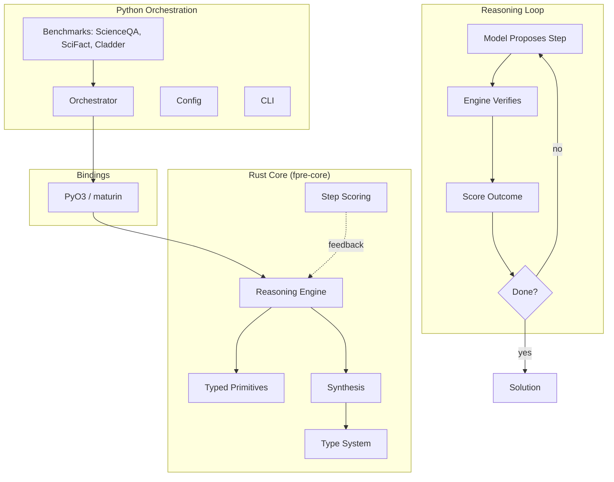

LLMs are remarkably good at intuiting answers and remarkably bad at the kinds of structured problems where every step has to be correct or the whole chain is wrong. Math proofs, dependency resolution, type checking, certain kinds of planning. The standard answer is "scale the model" and it works, sort of, up to a point. fpre takes a different bet: a smaller model paired with a typed reasoning engine that verifies each step is usually more reliable than a bigger model trying to bluff its way through.

## Purpose

fpre (First Principles Reasoning Engine) is a hybrid reasoning system. A neural component proposes candidate steps. A typed engine of primitives checks them. The loop continues until the problem is solved or the engine declares the proposed step inconsistent. The point is to push the structural correctness burden off the model and onto a system that's actually good at structure.

The architecture is split. The core is in Rust, with the engine, primitive set, scoring, and synthesis layers. The orchestration and benchmark layers are in Python, with bindings via PyO3 and maturin. The split matches the reality: the typed engine wants to be fast and rigorous, the orchestration wants to be flexible.

## Architecture

The reasoning loop is straightforward. A neural model (configurable, from local 7B up to a remote large model) proposes a candidate next step toward solving the problem. The engine takes that step, checks it against the typed primitives, and either accepts it or rejects it with a reason. The scoring layer records both the model's confidence and the engine's verdict. If the step is accepted, the engine updates the problem state; if rejected, the model gets the rejection reason and proposes again. The loop continues until the problem is solved, the budget is exhausted, or the engine declares the trajectory unproductive.

The typed primitives are the heart of the engine. They're the operations the engine knows how to verify: type-checked function applications, validated set operations, range-bounded arithmetic, structurally correct logical inferences. The model can propose anything; the engine accepts only proposals that reduce to a valid primitive composition.

Synthesis is where the engine assembles primitive compositions into higher-level steps. The model can suggest "apply X to Y"; synthesis figures out whether that suggestion reduces to a valid sequence of primitives. This is what lets the model speak in natural language while the engine still gets to verify in formal terms.

Benchmarks include ScienceQA (multimodal science reasoning), SciFact (scientific fact verification), and Cladder (causal reasoning). These cover the range of problem types where hybrid neural-plus-symbolic systems tend to outperform either component alone.

## Design decisions we made on purpose

**Rust core, Python orchestration.** The engine has to be fast and correct. Rust gives us both. The orchestration and benchmarks want to be flexible and integrate with the broader Python ML ecosystem. Python wins there. PyO3 plus maturin makes the boundary clean.

**Typed primitives, not free-form logic.** The engine doesn't try to verify arbitrary mathematical claims. It verifies compositions of a fixed, well-defined primitive set. This is both more tractable and more honest: the engine knows what it can check, and it refuses to bluff about the rest.

**The model is a proposer, not an oracle.** Treating the model as an unreliable but creative source of next-step hypotheses is more productive than treating it as an authority. The engine is the authority. The model is the search.

**Benchmark-driven development.** The three benchmarks aren't just for the eventual paper. They're the development feedback loop. A change that improves Cladder but breaks ScienceQA is suspect, and so on.

## Integration with other CDR projects

fpre is research-grade and connects to the rest of CDR through the agent reasoning surfaces.

- [**rlm-linux**](/blog/rlm-linux-architecture)'s Conductor is a natural consumer. Workflow planning often requires structured reasoning (dependency resolution, version compatibility, ordering constraints) that fpre is built for. The Conductor proposes; fpre verifies.
- [**Orchestack**](/blog/orchestack-architecture)'s Model Router could route reasoning-heavy agent tasks through fpre when the task warrants it. Most tasks don't need formal verification; some do.
- [**CDRcache**](/blog/cdrcache-architecture) caches engine-verified step sequences. Reasoning over the same problem starting state with the same set of primitives reaches the same conclusion, every time. The cache makes that conclusion instant on the second pass.
- [**CDRdistill**](/blog/cdrdistill-architecture) is research-adjacent. fpre asks "what does a small model plus structure beat?" CDRdistill asks "what does a small grounded model beat?" Different angles on the same question of how much you can do without scaling up.

## Status

Active research. Source at github.com/CoastalDigitalResearch/fpre.

What's built:

- Rust workspace with `fpre-core` (engine, primitives, scoring, synthesis, types) and `fpre-python` (PyO3 bindings)
- Python orchestrator layer with config and CLI
- Benchmark runners for ScienceQA, SciFact, and Cladder
- Test suite covering the engine, orchestrator, synthesis, memory, and logical primitives

What's not yet in scope:

- Published benchmark numbers. The pipeline runs; the head-to-head against pure-LLM baselines comes next.
- A formal verification of the typed primitive set itself. Currently the primitives are tested but not proved correct.
- A GRPO or DPO fine-tune of the proposer model using engine-verdict signal. The reward signal exists in the scoring layer; the training pass against it doesn't yet.
- Multi-modal primitives. ScienceQA has image components that the current primitive set doesn't handle.

## Open questions we're working through

- **The right primitive set.** Every primitive added expands what the engine can verify; every primitive added also adds surface area for bugs. Where's the sweet spot? Probably "the smallest set that covers the target benchmark domain," but that's circular.
- **Proposer-engine bandwidth.** The proposer sends natural-language steps; the engine has to parse them into primitive compositions. That parse step is itself error-prone. A more structured intermediate language would be cleaner but harder for the proposer to generate.
- **Engine rejection as training signal.** When the engine rejects a proposed step, that's a strong signal the model should learn from. Getting that signal back into the proposer (online RL? batched fine-tune? in-context examples?) is an open design choice.
- **What fpre is not.** It's not a theorem prover. It's not Lean or Coq. The typed primitive system is much weaker than either of those. The trade is that the model side can be much more capable than what a traditional theorem prover can interface with. Whether that trade is worth it for the target benchmark domains is the research question.
