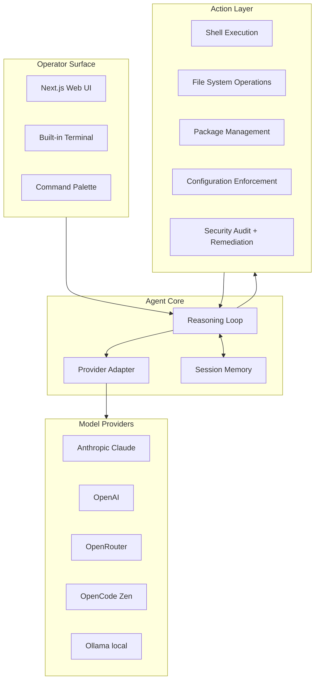

There's a category of work that every Linux operator does every week, and it never gets more interesting the second or fiftieth time you do it. Apply the security updates. Reconcile the configuration drift. Check the log for the thing that's been creeping. Audit the SELinux rules. Rebuild the dotfiles after the laptop reset. Each individual task is straightforward, the cumulative time spent on it is enormous, and none of it is the reason you sit down at the keyboard. mae is the persistent agent that takes that work off the human.

## Purpose

mae is short for "Minimal Agentic Environment." It runs on a Linux box (laptop, workstation, server, anything systemd-based) and keeps the system healthy: applies OS and package updates, enforces declarative configuration, audits security posture, and executes whatever ad-hoc tasks you hand it through a web UI. The goal is a self-managing workstation where the human focuses on work, not maintenance.

mae is multi-provider by design. It runs against Anthropic Claude, OpenAI, OpenRouter, OpenCode Zen, or fully local models via Ollama. The model choice is a setup decision, not an architectural one, and you can run the whole thing offline against a local 7B if that's what your environment requires.

## Architecture

mae has three layers: the agent core that does reasoning, the action layer that touches the system, and the operator interface that lets a human watch and direct what's happening.

The reasoning loop pulls a task from the operator, plans the steps, executes through the action layer, observes results, and decides what to do next. The provider adapter abstracts which model backend is running, so the same loop works against Claude or a local Ollama instance. Session memory carries context across the reasoning loop's iterations, and through MEMORY.md persists across mae restarts.

The operator surface is a Next.js app that gives you a chat with the agent, a built-in terminal for direct system interaction when you want to bypass the agent, and a command palette for common operations. The terminal is there because sometimes you just want to type `ls -la` without a model intermediating.

## Design decisions we made on purpose

**Multi-provider, not vendor-locked.** mae is useful only if it works against the model an operator can actually run. That includes operators with strict data-locality requirements who need a fully local model. The provider adapter is a thin interface; adding a new backend is an afternoon's work.

**Web UI plus terminal, not one or the other.** Some tasks are easier to describe in natural language; others are easier to type directly. mae assumes both, and the operator switches between them per task.

**Setup wizard before configuration files.** On first launch with no provider configured, mae opens a setup wizard at `/init` instead of failing or demanding you edit a config file. This is the friction we'd actually want to remove for ourselves; we removed it.

**System changes are auditable.** Every action mae takes is logged in enough detail to reconstruct what happened, with a clear distinction between "agent decided to" and "operator explicitly asked for." This is the same audit-trail principle that runs through CDRcache and Orchestack.

## Integration with other CDR projects

mae is one of the canonical "system agents" we want to be runnable on top of Orchestack, but it stands alone too.

- [**Orchestack**](/blog/orchestack-architecture) is the platform that mae naturally fits into. As an Orchestack system agent, mae gets a connector-mediated chat surface, policy-enforced action permissions, and a sandboxed execution plane. Running mae standalone is fine; running it inside Orchestack adds multi-tenant safety.
- [**CDRcache**](/blog/cdrcache-architecture) sits underneath mae's reasoning loop. Repeated planning calls for the same kind of system event (e.g., a kernel upgrade on Fedora) hit cache after the first time, which makes mae cheaper to run on similar tasks.
- [**rlm-linux**](/page/projects#rlm-linux) is a sibling project. Where mae focuses on running an agent on an existing system, rlm-linux focuses on composing and maintaining the system itself. The two complement each other: rlm-linux builds the substrate, mae operates on it.
- [**Pachyterm**](/page/projects#pachyterm) is a natural client for mae. Type `p` in Pachyterm to send a prompt to a local model; that local model can be a mae instance running on the same box.

## Status

In daily use as a personal Linux maintenance agent. Source at github.com/CoastalDigitalResearch/mae. Originally forked from VibeOS and rebuilt around how we think about agent-managed systems.

What's built:

- Reasoning loop with the five provider backends
- Web UI for chat, terminal, and command palette
- File operations, shell execution, package management, configuration enforcement
- Security hardening audits and remediations
- Setup wizard for first-run provider configuration
- MEMORY.md as persistent context across sessions

What's deferred to later:

- Multi-machine coordination (one mae managing a small fleet)
- Declarative system-state files (think NixOS-style declarations, but agent-driven)
- A test suite for the destructive operations (the ones that touch package installs and system configs are hard to test without VMs)
- Plugin hooks so users can extend the action layer without forking

## Open questions we're working through

- **The trust boundary.** mae has the keys to your system. How do we make it observably safer than a script that does the same things, without making it so locked down that operators just go around it? The pattern we keep landing on is "ask for confirmation on destructive actions" plus "log everything," but the confirmation prompts get repetitive fast.
- **Local-model sufficiency.** The provider abstraction is solid; the open question is whether a 7B local model is actually good enough for the full range of system-management tasks, or whether the operator needs to know which tasks reliably work with which provider. We have anecdotes; we don't have a clear matrix.
- **Configuration drift detection.** "Did this file change because the operator did something, or because some service rewrote it, or because someone else logged in and edited it?" is harder than it sounds. Filesystem audit hooks help. They don't fully solve it.
- **Boundaries with rlm-linux.** Where exactly does "operating a system" stop and "composing a system" begin? We've drawn the line based on "is the system already installed?" but that's pragmatic rather than principled. Worth a write-up of its own once we've used both more.
