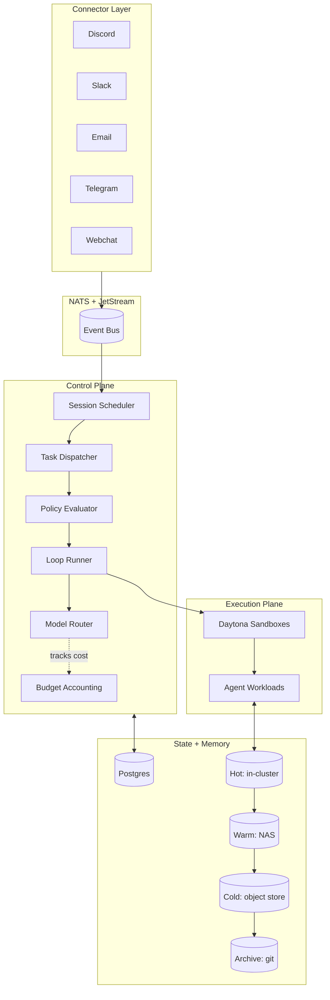

Most agent demos run as a single Python script with hard-coded API keys, a single tool, and a single user. That works for proving an idea. It does not work when you have multiple agents running on behalf of multiple operators, talking to multiple platforms, executing actions that touch real systems, with auditability and rate limits and budget controls and a policy layer. The gap between "demo agent" and "production agent infrastructure" is the gap Orchestack fills.

## Purpose

Orchestack is a multi-tenant orchestration platform for agent systems. It runs on Kubernetes, talks to operators through chat connectors (Discord, Slack, Email, Telegram, Webchat), executes work in isolated sandboxes, routes requests through a policy-aware model router, and keeps a hierarchical memory system that scales from hot in-cluster cache to cold archive storage.

The design goal we kept coming back to: handle 100+ concurrent agent sessions with sub-500ms response latency, while making it easy to onboard new agents in under 30 seconds and supporting 80% automation of routine infrastructure tasks. Internal operators first. Selected external users in v1.5. Multi-tenant SaaS is a v2 problem.

## Architecture

At the top level, Orchestack decomposes into a control plane, an execution plane, a connector layer, and a tiered memory system. Everything talks through NATS for events and Postgres for authoritative state.

A request enters through a connector (someone messages an agent on Discord, say). The connector publishes a normalized message envelope to NATS. The Session Scheduler picks it up, assigns a session, and the Task Dispatcher decomposes the work. The Policy Evaluator decides what the agent is allowed to do for this tenant. The Loop Runner drives the agent's reasoning loop, with the Model Router picking the right model based on data sensitivity, latency budget, and cost. Execution happens in Daytona sandboxes, one per active session. Everything emits audit events back to NATS for observability.

## Design decisions we made on purpose

**Progressive security disclosure.** Defaults are strict: deny-all RBAC, local embeddings only, ephemeral sandboxes that get torn down between tasks. Power users get documented escape hatches when they need them. IT compliance is happy. AI research isn't blocked.

**Agent-centric ownership.** The unit of ownership is the agent, not the team or project. This matches how operators actually think about agents, and it sidesteps a class of cross-team permission problems that we kept hitting in earlier designs.

**GitOps for everything.** Runbooks, policies, agent definitions, all in git. Memory tier L3 is a cache. Git is source of truth. This gives us auditability for free and lets agents move fast against a stable substrate.

**Privacy-first model routing.** Sensitive data routes to local models by default. External APIs only for non-sensitive, quality-critical tasks. The Policy Evaluator gates the routing decision so this isn't a convention, it's enforced.

**Tiered memory matches tiered storage economics.** Hot in-cluster for the working set. Warm NAS for the recent past. Cold object storage for historical. Archive in compressed git for the deep cold. The agent doesn't know the difference. The bill does.

## Integration points with other CDR projects

Orchestack is meant to be the harness that other CDR work runs on top of, or feeds into.

- [**CDRcache**](/page/projects#cdrcache) sits inside the Loop Runner as the semantic cache for agent outputs. When an agent produces the same result for the same input, Orchestack short-circuits the rerun and serves from cache. Hash-addressed, deterministic, audit-friendly.
- [**CDRnext**](/page/projects) (private; successor to CDRmem and CDRdistill) is where the architectural-memory work lands. The memory access gates and fast-weight modules from that research are what we want eventually plugged in behind the Hot tier of Orchestack's memory system.
- [**mae**](/page/projects#mae) and [**rlm-linux**](/page/projects#rlm-linux) are exactly the kind of system agents the platform was designed to host. They run as long-lived agents inside dedicated sandboxes, with the connector layer giving operators a way to direct them through chat.
- [**TopoLI**](/page/projects#topoli) and [**fpre**](/page/projects#fpre) feed into the Model Router as candidate components: pruned retrieval and typed-primitive reasoning are both routing decisions that depend on the task at hand.
- [**Pachyterm**](/page/projects#pachyterm) and [**CDRbrowser**](/page/projects#cdrbrowser) are end-user surfaces that can act as clients of Orchestack agents, but they don't run inside the orchestrator itself.

## Status

v1 is in active development. The architecture is set; the RFCs (event and state model, isolation and policy, identity, payments, extensibility) are written and reviewed. Implementation is monorepo and polyglot: Go for the high-concurrency control plane, Python for connectors and ML, TypeScript for any web UI.

What's targeted for v1 Phase 1 (the core that has to ship and stabilize first):

- Session Scheduler, Task Dispatcher, Policy Evaluator, Loop Runner as separate services
- Model Router with dynamic registration and size-plus-locality fallback
- Budget Accounting per model and per provider
- All five connectors: Discord, Slack, Email, Telegram, Webchat
- NATS event bus with JetStream for durable streams
- Postgres for authoritative state, Atlas for schema migrations
- Daytona for sandbox execution
- Vault for secrets, OIDC plus LDAP for identity, SPIFFE for service identity

What's deferred to Phase 2 (built on top of the proven core):

- On-chain trust and payments (RFC-004) for cross-tenant economics
- Modularized extensibility surface (RFC-005) for third-party plugins

Deployment is via a Kubernetes Operator for clusters and Podman or Docker Compose for local development. CI/CD targets Tekton primary, with support for GitLab CI and GitHub Actions for upstream contributors.

## Open questions we're working through

The honest part. These are unresolved in the architecture docs and we don't have clean answers yet.

- How aggressive should default budget caps be before we surprise an operator with an out-of-budget pause? Strict defaults are friendlier to IT compliance but unfriendlier to research workflows.
- Where exactly does DLP (data-loss prevention) plug in? Inline at the policy evaluator, async on the audit stream, or both? The mydlp tooling can do either; the right answer depends on latency budget.
- For the on-chain piece in Phase 2, the unresolved question is whether we want a public ledger or a permissioned one. Both have legitimate use cases. We have not committed to either.
- What's the right boundary between a "system agent" (long-lived, run by the platform itself) and a "user agent" (spawned per session, torn down after)? mae and rlm-linux blur this line, and the policy implications are different in each direction.

If any of these turn into a research thread on their own, we'll write it up.
