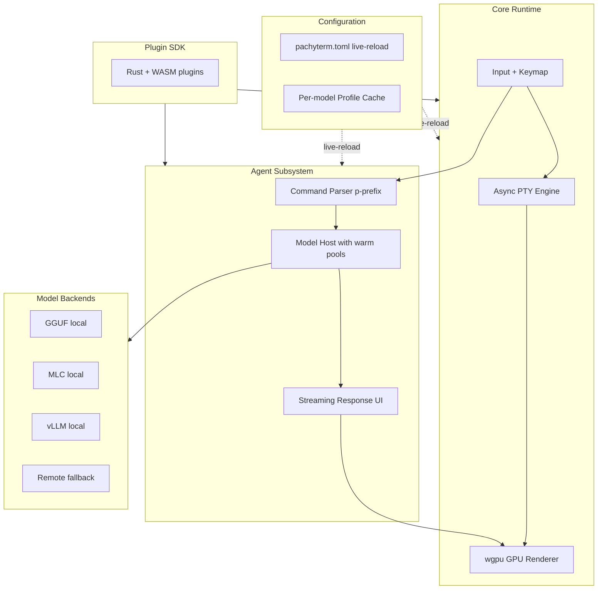

The terminal is where developers spend the most time and where the AI tooling story is the worst. The options today are either fast (Alacritty, Kitty, WezTerm) with no AI integration, or AI-integrated (Warp) with proprietary lock-in and macOS-mostly availability. Pachyterm is the answer to "why does this have to be a tradeoff."

## Purpose

Pachyterm is a cross-platform, GPU-accelerated terminal emulator with native AI agent integration, built in Rust. It targets sub-50ms time-to-first-frame, sub-300ms AI response times against local 7B 4-bit models, and 100% POSIX compatibility so it works with every shell and TUI you already use. The model integration is local-first: GGUF, MLC, vLLM all supported, with remote fallback when you want it.

The activation pattern is one keystroke. Type `p` at the beginning of any line and the rest of that line becomes an LLM prompt. No context switch, no menu, no separate window. The AI shows up exactly where your typing already lives.

## Architecture

Pachyterm is modular in the way fast terminals usually are: a tight core for input, output, and rendering, with extension surfaces for the AI layer and the plugin system.

The TTY engine is async PTY management with zero-copy input and output buffers. The renderer is wgpu-backed with hardware-accelerated text and ligature support, targeting 144 FPS with sub-1ms round-trip echo under load. The input layer handles configurable keybindings that preserve native shell behavior, so your existing `Ctrl-R` muscle memory still works.

The agent subsystem watches input. When a line starts with `p`, the parser routes the rest of the line to the model host instead of the shell. The model host manages local and remote backends with warm pools, so first-token latency stays low. The streaming UI renders the response inline with markdown support.

Configuration is plain TOML with live-reload. Edit `pachyterm.toml`, save, the change applies without a restart. Profiles cache per-model settings (system prompts, temperature, max tokens) so switching between models is a single flag rather than a config dance. Optional encryption on the profile cache for stored API keys.

Plugins are Rust or WASM, sandboxed, with a defined SDK surface. The plugin system is meant to handle the "add a new command type" case without anyone forking the terminal itself.

## Design decisions we made on purpose

**POSIX compliance is non-negotiable.** Warp's biggest problem isn't its proprietary licensing; it's that it isn't a real terminal, so a huge slice of TUI applications break inside it. Pachyterm is a real terminal first, an AI surface second. Every shell, every editor, every TUI tool you already use works unmodified.

**Local-first AI.** Cloud-only AI in your terminal means latency, data egress, and a hard dependency on someone else's uptime. Local-first means the response time stays under 300ms and your prompts stay on your machine by default.

**Plain-text configuration.** No GUI settings panel, no proprietary format. Edit a TOML file, live-reload picks it up. This is how power users actually want to configure tools.

**GPU acceleration without GPU dependency.** The wgpu renderer uses whatever's available (Vulkan, Metal, DirectX) but degrades gracefully on systems without a real GPU. Targets a 144 FPS render path, falls back to a sane software path otherwise.

## Integration with other CDR projects

Pachyterm is end-user surface, not infrastructure. It connects to the rest of CDR in a few directions.

- [**mae**](/blog/mae-architecture) can be the model behind the `p` prefix. A local mae instance running on the same box becomes the agent that responds when you type `p`. You get system-aware answers without leaving the terminal.
- [**Orchestack**](/blog/orchestack-architecture) is an obvious "remote backend" target for the model host. When the `p` prompt warrants a heavier model or a multi-step agent flow, the model host can route to an Orchestack-hosted agent and stream the response back into the terminal.
- [**CDRcache**](/blog/cdrcache-architecture) is a candidate plugin: caching the response for an identical `p` prompt across sessions. Most terminal-level prompts are short and recurring (`p what does this error mean`), so the hit rate would be high.
- [**rlm-linux**](/blog/rlm-linux-architecture) ships Pachyterm in its base profile as the default terminal. The combination is the workstation experience we're building toward.

## Status

Source at github.com/CoastalDigitalResearch/Pachyterm. Last significant push was August 2025; this is an active project but not the most-recently-touched.

What's built:

- TTY engine with async PTY and zero-copy buffers
- wgpu renderer with ligature support
- Input/keymap layer with configurable bindings
- Command parser for the `p` prefix activation
- Model host with GGUF, MLC, vLLM backends
- Plain-text TOML configuration with live-reload
- Profile cache for per-model settings

What's deferred:

- Cross-platform parity. Native macOS and Linux work; Windows is on the list but not done.
- Streaming markdown render quality. Currently markdown is rendered post-stream; ideally we'd update incrementally as tokens arrive.
- Plugin SDK formalization. The internal extension surface exists; making it a real SDK that third parties can build against takes more work.
- A test suite that actually covers the GPU paths reliably. Headless GPU tests are notoriously flaky.

## Open questions we're working through

- **Latency targets that hold under load.** The 50ms first-frame target is achievable in isolation. Whether it holds when there's a heavy SSH session, a big background build, and an active model streaming a response is the real question.
- **Discoverability of the `p` prefix.** Users who don't know it's there will never use it. Users who do know will love it. The middle ground is a one-time hint, maybe? We don't want to be the terminal that runs a setup tutorial.
- **Remote-backend safety.** When the model host falls back to a remote API, the prompt content leaves the machine. That's expected for the user who configured a remote backend, but it's the kind of thing that should be visible (a small indicator in the prompt UI) so it's never an accident.
- **The right unit for plugins.** Should plugins extend the agent subsystem (new model backends, new prompt patterns)? Or extend the terminal itself (new render modes, new keybindings)? Currently both, which is probably one too many surfaces for a stable plugin contract.
