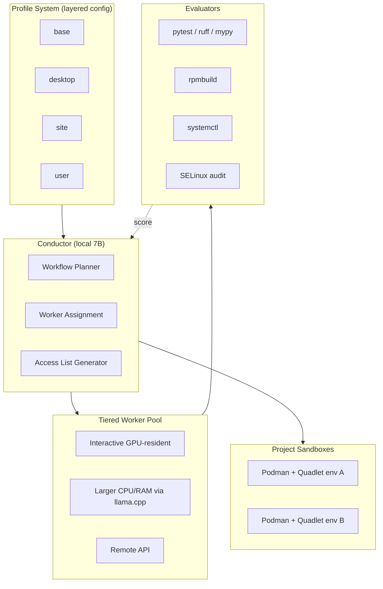

A Linux installation is a million tiny decisions baked into a thousand files. Most of those decisions are reasonable defaults you'd never change. Some are personal preferences you re-apply every time you reinstall. Some are workflow optimizations that took years to arrive at and exist only in your muscle memory. The standard answer is dotfiles plus a kickstart plus some shell scripts plus, increasingly, a Nix or Ansible setup. rlm-linux is the agent-driven answer to the same problem.

## Purpose

rlm-linux does two things. First, it composes a custom Fedora 44-based image from a profile system: package set, kickstart, systemd services, desktop environment, dotfiles, all driven by layered config with sensible defaults. Second, once installed, it becomes the resident customization layer on the system, orchestrating package upgrades, configuration drift, log triage, RPM authoring, and the lifecycle of isolated AI project sandboxes.

The architecture leans on a Sakana-style RL Conductor pattern: a small local model emits full agentic workflows in natural language, which then get executed against a tiered pool of LLM workers based on the latency and capability budget of each subtask.

## Architecture

The Conductor is the heart of it. It's a small (7B) local model whose job is not to do the work but to plan the work. It takes a system event ("kernel update available", "config file changed", "operator asked for X"), emits an agentic workflow as natural-language subtask plans, assigns workers based on latency budget, and produces an access list scoped to what the workflow needs.

Workers are tiered. The interactive GPU-resident model handles things that need to be fast and small. Larger CPU/RAM-resident models via llama.cpp handle deeper reasoning tasks that can wait a few seconds. Remote API models are the long tail for anything that exceeds local capability.

Evaluators are where the system gets honest. Every workflow produces verifiable signals (pytest pass/fail, ruff lint, mypy strict, rpmbuild success, systemctl status, SELinux audit). Those signals score the workflow and feed an eventual GRPO fine-tune of the Conductor. The model gets better at planning over time because it gets to learn from what actually worked.

Sandboxes are per-project Podman+Quadlet environments. Each AI project runs in its own sandbox with a scoped Conductor instance, an isolated trace store, and a shared model cache. This is how you run five experiments at once without them stepping on each other's CUDA, their dependencies, or their assumptions about the file system.

## Design decisions we made on purpose

**Profile layering.** Configuration is composed in layers: base → desktop → site → user. The same tool ships an opinionated GNOME default for adoption, while power users compose their own desktop, services, and worker pools by overlaying. This is the closest equivalent to Nix's overlay model in the RPM world.

**Local conductor, tiered workers.** The Conductor stays local for privacy, latency, and cost. Workers are tiered because not every subtask needs a 70B model, and most subtasks shouldn't pay for one.

**Verifiable evaluators.** Every workflow ends with a measurement, not a vibe-check. rpmbuild either succeeds or it doesn't. Pytest either passes or it doesn't. The Conductor's learning signal is grounded in those outcomes.

**Sandboxes are first-class.** AI project work is messy. CUDA versions conflict. Python environments rot. Models get downloaded and forgotten. Per-project sandboxes turn the mess into something containable.

## Integration with other CDR projects

rlm-linux is system-level infrastructure. It connects to the rest of CDR work in a few specific ways.

- [**mae**](/blog/mae-architecture) is the sibling project. rlm-linux composes and maintains the substrate; mae operates the agent on top of it. Running both gives you a Fedora system that builds itself from a profile and then keeps itself healthy on autopilot.
- [**Orchestack**](/blog/orchestack-architecture) is where the Conductor pattern eventually wants to live. The Conductor + tiered workers design is exactly what Orchestack's Model Router is intended to do at scale; rlm-linux's implementation is a smaller-scoped predecessor that informed the design.
- [**CDRcache**](/blog/cdrcache-architecture) memoizes Conductor planning outputs. Many system events recur ("apply weekly security update"), and the resulting workflows are nearly identical each time. Cache hits short-circuit the planning step.
- [**fpre**](/page/projects#fpre)'s typed-primitive reasoning is a candidate component for the Conductor when a workflow needs grounded symbolic structure (e.g., dependency resolution, package version compatibility checks).

## Status

Early. Source at github.com/CoastalDigitalResearch/rlm-linux. Personal project of [@AdamPippert](https://github.com/AdamPippert) per the README.

What's built:

- Profile system with base/desktop/site/user layers
- Conductor with workflow emission
- Three-tier worker pool with local-GPU, local-CPU, and remote API backends
- Evaluators wired up to pytest, ruff, mypy, rpmbuild, systemctl, SELinux audit
- Podman+Quadlet sandbox lifecycle
- Shared model cache across sandboxes

What's not yet built:

- The GRPO fine-tune of the Conductor. The evaluator scores are being collected; the actual training pass against those scores is on the list, not done.
- A web UI. Right now everything is CLI-driven, which is fine for the maintainer but a barrier for anyone else.
- Drift remediation policies (the system can detect drift; how it decides what to do about it is currently per-handler logic rather than declarative policy).
- Multi-machine support. One conductor per system today.

## Open questions we're working through

- **The right size for the Conductor.** 7B is small enough to run interactively on a desktop GPU. Is 7B big enough to actually plan well, or is it leaning on the worker pool to compensate? The GRPO experiment will tell us, eventually.
- **Profile boundaries.** Where do you draw the line between "base layer" (everyone gets this) and "desktop layer" (only people running a desktop)? We started with reasonable splits and they're already getting tangled. A clearer ontology is warranted.
- **Worker pool elasticity.** The tiered pool design assumes workers are roughly always available. What happens when the local GPU is occupied or the remote API is rate-limited? The Conductor currently queues; whether it should fail fast or fall back to a smaller worker is unclear.
- **Sandbox proliferation.** Per-project sandboxes are great until you have 40 of them. There's no garbage collection policy yet beyond manual cleanup. Worth a write-up once the pattern is more proven.
