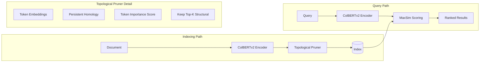

ColBERT-style late-interaction models are the best-performing dense retrievers we have, but they pay for that quality in storage. A single document becomes a bag of token-level embeddings, dozens or hundreds per document, all of which have to be stored and scanned at query time. The standard answer is to compress (PQ, OPQ) or to prune somewhat-arbitrarily by frequency. TopoLI proposes a better question: which tokens are actually load-bearing for retrieval, and can we use topology to find them?

## Purpose

TopoLI (Topological Late Interaction) is a ColBERTv2 variant that uses persistent homology from topological data analysis to identify and keep only the tokens that contribute structural information to retrieval, pruning the rest. The result is fewer stored token embeddings per document with minimal retrieval-quality loss.

The intuition: in the embedding space of a document's tokens, some tokens are bridge points that connect distinct semantic clusters, and some tokens form boundary cycles around those clusters. Both are structurally informative. Tokens in the dense interior of a cluster are largely redundant. Persistent homology gives us a principled way to identify the structural tokens.

## Architecture

TopoLI is a drop-in modification to a standard ColBERT pipeline. Encoding and scoring happen as usual; an extra topological-pruning step sits between document encoding and indexing.

The topological pruner takes the full set of token embeddings for a document and runs persistent homology over them. The output is a per-token structural importance score. The pruner then keeps the top-K most structurally significant tokens (bridges between clusters, points on topological cycles) and discards the rest.

At query time, scoring is unchanged: MaxSim between query tokens and the (now-smaller) document token bag, summed across query tokens. Because the kept tokens are the structurally important ones, retrieval quality drops far less than uniform random pruning would suggest.

TopoLI ships three preset configurations:

- `baseline_colbertv2()` keeps all tokens. The reference comparison.
- `topo_aggressive()` prunes about 70% of tokens. Storage drops by roughly 3x.
- `hybrid_topo_idf()` combines topological scoring with IDF weighting for tokens that are rare in the corpus and informative for retrieval.

## Design decisions we made on purpose

**Drop-in compatibility with ColBERTv2.** The query-time path doesn't change. Any system that already speaks ColBERT scoring can use a TopoLI-pruned index without code changes beyond the index format.

**Topology, not just frequency.** IDF-style pruning is fast and obvious; it keeps rare tokens. The problem is that "rare" and "structurally important" aren't the same thing. Topology measures actual structural role in the embedding space of the specific document, not just statistical rarity in the corpus.

**Configurable aggressiveness.** Pruning is a tradeoff. The presets cover the range from "no pruning" to "aggressive" to "topo plus IDF combined." Real deployments will fall somewhere in this space depending on how much storage they're willing to trade for retrieval quality.

**Apache-2.0 and reproducible.** The repo includes the full pipeline and benchmarks. Anyone can reproduce the storage-vs-quality tradeoff on their own corpus.

## Integration with other CDR projects

TopoLI is research-grade and connects to the more application-facing CDR work through retrieval pipelines.

- [**CDRcache**](/blog/cdrcache-architecture) memoizes the persistent homology computations, which are the expensive part of indexing. Re-indexing a document corpus that mostly hasn't changed becomes substantially faster.
- [**Orchestack**](/blog/orchestack-architecture)'s Model Router can dispatch retrieval queries to a TopoLI-backed index when the agent task involves retrieval over a corpus that has been prepared this way. The router knows which indexes are available and matches them to the query.
- [**CDRbrowser**](/blog/cdrbrowser-architecture)'s source collation pipeline is a natural consumer. "Find related claims across pages" is a retrieval problem; TopoLI keeps the index small enough to ship inside the browser's resource budget.
- [**CDRdistill**](/blog/cdrdistill-architecture) is a sister research project. Both ask "what's the minimal representation that preserves the property we care about?" CDRdistill asks it of model weights; TopoLI asks it of document embeddings. The mental models are similar.

## Status

Active research. Source at github.com/CoastalDigitalResearch/TopoLI.

What's built:

- The full TopoLI pipeline with topological pruner integrated into ColBERTv2 indexing
- Three preset configurations (baseline, aggressive, hybrid)
- A clean Python API with `execute_pipeline()` entry point
- Test suite under `topoli/tests/` runnable via `uv run pytest`
- Ruff lint and strict mypy enforced

What's not yet in scope:

- Production-scale benchmarks against MS MARCO and BEIR. The pipeline works; the published numbers come next.
- Approximate persistent homology computation. The exact algorithm is correct but doesn't scale linearly to multi-million-document corpora yet.
- A direct comparison against PQ/OPQ-based ColBERT compression. We expect TopoLI to win on quality at high compression ratios; we don't have the head-to-head numbers yet.

## Open questions we're working through

- **What's the right K?** Keeping the top-K most structural tokens is the lever. Too few and you lose retrieval quality; too many and you barely beat baseline. The optimal K likely depends on document length distribution; we don't have a clean heuristic yet.
- **Persistent homology at scale.** The exact computation is expensive. Approximations (Vietoris-Rips with subsampling, sparse Rips) exist but introduce their own quality questions. Where on that frontier should TopoLI sit?
- **The hybrid configuration's weighting.** Combining topological importance with IDF works in our tests; the relative weights are tuned by hand right now. A learned combination is probably better.
- **Generalization to other late-interaction models.** ColPali, ColBERTv2.5, and other variants all share the bag-of-token-embeddings shape. The topological pruning idea should transfer, but we haven't yet validated.
